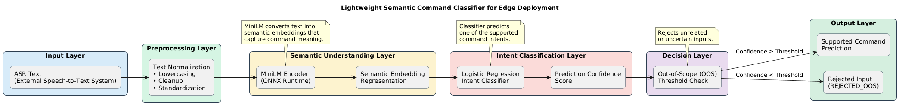

# Lightweight Speech Command Classifier for Edge Deployment

## Overview

This project implements a lightweight semantic command classifier for automotive and IoT voice-control systems. Given text from an external ASR system, the classifier identifies the intended command from a predefined set of supported actions and rejects unrelated queries using Out-of-Scope (OOS) detection.

The system is designed to handle command variations and noisy transcriptions while remaining suitable for edge deployment through ONNX export and INT8 quantization.

---

## Features

* Semantic command understanding using sentence embeddings
* Confidence-based Out-of-Scope (OOS) rejection
* Robustness to noisy ASR outputs
* Support for Indian-English command variations
* Fully offline inference
* ONNX deployment support
* INT8 quantization for edge devices
* Real-time CPU inference

---

## Supported Commands

### Core Commands

| Command |
| - |
| activate do not disturb  |
| deactivate do not disturb |
| decline the call |
| pick up the call |
| play the music |
| pause the music |
| play the next song |
| play the previous song |
| increase the volume |
| decrease the volume |

### Extension Commands

| Command             |
| ------------------- |
| increase the brightness |
| decrease the brightness |
| start the vehicle      |
| stop the vehicle       |

---

## System Architecture

<p align="center">
  <picture>
    
  </picture>
</p>

The system receives text generated by an external ASR engine and first applies text normalization to clean and standardize the input. The normalized text is then converted into semantic embeddings using MiniLM, which captures the meaning of the command. These embeddings are passed to a Logistic Regression classifier that predicts the most likely command intent. Finally, a confidence threshold is applied to determine whether the prediction is reliable. Inputs with confidence above the threshold are returned as valid commands, while low-confidence inputs are rejected as Out-of-Scope (OOS).


---

## What Was Built

### Dataset Generation

A synthetic dataset generation pipeline was developed to create realistic training data containing:

* Clean command examples
* Semantic paraphrases
* Simulated ASR transcription errors
* Character-level noise
* Filler words
* Indian-English command variations
* Out-of-Scope (OOS) queries

### Command Classification

The classification pipeline consists of:

* SentenceTransformer MiniLM embeddings
* Logistic Regression classifier
* Confidence-based OOS rejection

### Edge Deployment

The trained model was:

* Exported to ONNX
* Quantized using INT8
* Benchmarked on CPU
* Deployed for fully offline inference

---

## Project Structure

```text
LWSCCED/
│
├── models/
│   ├── classifier.joblib
│   └── embedding_model/
│
├── onnx_encoder/
│   ├── model.onnx
│   └── model_int8.onnx
│
├── onnx_classifier/
│   └── classifier.onnx
│
├── evaluation/
│   ├── confusion_matrix.png
│   └── evaluation_report.txt
│
├── src/
│   ├── data/
│   │   ├── train.csv
│   │   ├── test.csv
│   │   └── label_map.json
│   │
│   ├── generate_dataset.py
│   ├── train.py
│   ├── evaluate.py
│   ├── test.py
│   ├── benchmark.py
│   ├── export_encoder_onnx.py
│   ├── export_classifier_onnx.py
│   ├── quantize_onnx.py
│   ├── onnx_test.py
│   └── utils.py
│
├── requirements.txt
└── README.md
```

## Project Approach

The project began by creating a synthetic dataset using manually defined command examples for each supported intent. To make the dataset more realistic, command variations, paraphrases, simulated ASR errors, spelling variations, Indian-English expressions, and Out-of-Scope (OOS) queries were added. This helped the model learn to handle different ways users might express the same command.

MiniLM was used to convert input text into semantic embeddings, allowing the system to understand the meaning of commands instead of relying on exact keyword matches. It was chosen because it provides good semantic understanding while remaining lightweight and efficient.

These embeddings were used to train a Logistic Regression classifier, which was selected for its simplicity, fast inference, and suitability for edge devices. Finally, the model was exported to ONNX and optimized using INT8 quantization, resulting in a smaller, faster, and fully offline command classification system.


## Installation

### Clone the Repository

```bash
git clone https://github.com/harikrishnan669/LWSCCED.git
cd LWSCCED
```

### Create a Virtual Environment

```bash
python -m venv venv
```

Activate the environment:

**Windows**

```bash
venv\Scripts\activate
```

**Linux/macOS**

```bash
source venv/bin/activate
```

### Install Dependencies

```bash
pip install -r requirements.txt
```

---

## Running the Project

### 1. Generate Dataset

Creates the synthetic training and testing datasets used for model training and evaluation. The generated data includes command paraphrases, ASR noise, filler words, Indian-English variations, and Out-of-Scope (OOS) examples.


```bash
python generate_dataset.py
```

---

### 2. Train the Model

Generates sentence embeddings using MiniLM and trains the Logistic Regression classifier on the generated dataset.

```bash
python train.py
```

---

### 3. Evaluate the Model

Evaluates the classifier on the test set and generates:

Accuracy
Precision
Recall
F1-score
OOS detection metrics
Noise robustness metrics
Confusion matrix

```bash
python evaluate.py
```

---

### 4. Export Models to ONNX

Converts the MiniLM embedding model into ONNX format for deployment and optimization.
```bash
python export_encoder_onnx.py
```
Converts the trained Logistic Regression classifier into ONNX format.
```bash
python export_classifier_onnx.py
```
---

### 5. Quantize the ONNX Model

Applies INT8 quantization to reduce model size and improve inference speed on edge devices.

```bash
python quantize_onnx.py
```
## Model Optimization and Deployment

### ONNX Export

The trained model was exported to ONNX to make it easier to deploy and run efficiently on different platforms without relying on the original training environment.

### INT8 Quantization

After ONNX export, INT8 quantization was applied to reduce model size and improve inference speed for edge deployment.

### Results

| Model                | Size     |
| -------------------- |----------|
| Original ONNX Model  | 86.18 MB |
| Quantized ONNX Model | 21.79 MB |

**Model size reduced by 74.72%.**

### Deployment Performance

* Average CPU Latency: **2.46 ms**
* Fully Offline Inference: **Supported**
* Edge Deployment Ready: **Yes**

The final quantized model is smaller, faster, and suitable for real-time command classification on resource-constrained devices.

---

### 6. Run Inference on the Final Quantized Model

Runs inference using the final quantized ONNX model to verify that deployment artifacts work correctly.

```bash
python onnx_test.py
```

Example:

```text
Enter command: turn it down

Prediction : decrease_volume
Confidence : 0.91
```

---

### 7. Benchmark Latency

Measures CPU inference latency.

```bash
python benchmark.py
```

Example:

```text
Average Latency: 2.46 ms
```

---

## Performance

### Classification Performance

| Metric            | Score  |
| ----------------- | ------ |
| Accuracy          | 84.94% |
| Macro F1 Score    | 87.69% |
| Weighted F1 Score | 85.79% |

### OOS Detection

| Metric               | Score  |
| -------------------- | ------ |
| OOS Rejection Rate   | 97.73% |
| False Rejection Rate | 13.06% |

### Noise Robustness

| Noise Type      | Accuracy |
| --------------- | -------- |
| Clean           | 91.30%   |
| Paraphrase      | 86.67%   |
| ASR Noise       | 85.90%   |
| Filler Words    | 100.00%  |
| Dropped Words   | 76.19%   |
| Character Noise | 57.50%   |

### Edge Deployment

| Metric              | Result    |
| ------------------- | --------- |
| Export Format       | ONNX      |
| Quantization        | INT8      |
| Average CPU Latency | 2.46 ms   |
| Offline Inference   | Supported |

---

## Assumptions

* Input text is generated by an external ASR system.
* Commands belong to a predefined intent set.
* One command is expected per input.
* Unknown inputs should be rejected rather than forcefully classified.
* Synthetic augmentation is used to approximate real-world speech variations.

---

## Known Limitations

* Character-level spelling mistakes remain challenging.
* The dataset is primarily synthetic and may not capture all real-world speaking patterns.
* The current implementation supports English commands with limited Indian-English variations.
* Voice recognition (speech-to-text) is outside the scope of this project.
* Adding new commands requires retraining the classifier.
* OOS performance depends on the selected confidence threshold.

---

## Future Improvements

* Collect real-world speech transcripts for training.
* Improve robustness to spelling and transcription errors.
* Add multilingual command support.
* Support incremental learning for new commands.
* Deploy on embedded hardware platforms such as Raspberry Pi and Android devices.

---

## Technologies Used

* Python 3.11+
* Sentence Transformers (MiniLM)
* Scikit-learn
* ONNX Runtime
* NumPy
* Pandas
* Matplotlib
* Joblib

--- 
This project was developed as part of the UST Semicon Data Science Intern selection process. I am grateful for the opportunity to work on this assignment.
